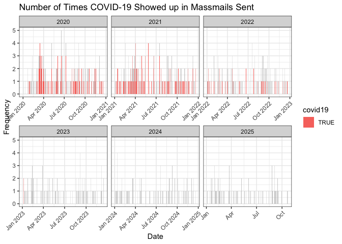
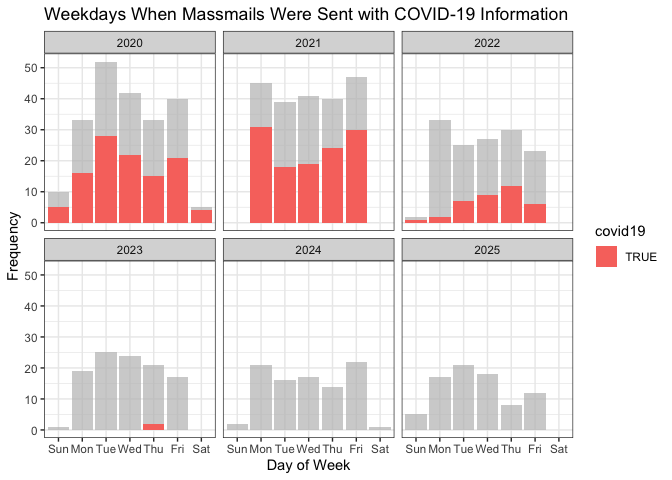
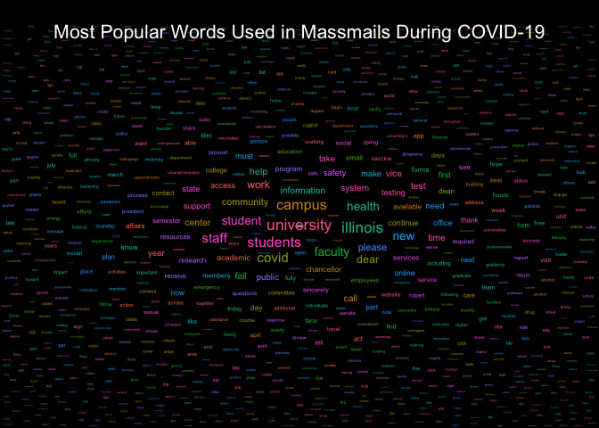

<!-- README.md is generated from README.Rmd. Please edit that file -->

# massmail

<!-- badges: start -->

[](https://github.com/illinois-r/massmail/actions)
<!-- badges: end -->

The goal of the massmail repository is to provide access to the mass
mailing archives at the University of Illinois at Urbana-Champaign
(UIUC). Each time the University sends an e-mail en-mass to community
members its contents, time, and recipient number is recorded publicly.
The archive may be viewed here:

<https://massmail.illinois.edu/massmailArchive>

Data has **830** observations and **7** variables:

  - `datetime`: Date and time when the email was sent in the form of
    `YYYY-MM-DD HMS` with either CDT or CST.
  - `date`: Date when the email was sent in the form of `YYYY-MM-DD`.
  - `time`: Time when the email was sent in the form of a 24 hour clock
    with `HH:MM`.
  - `sent`: Number of recipients of the massmail.
  - `subject`: Text displayed in the email subject line
  - `url`: Link to the official email in the massmail archive.
  - `content`: Contents of the email without html markup.

**Sample**

| datetime            | date       | time  |  sent | subject                                  | url                                                   |
| :------------------ | :--------- | :---- | ----: | :--------------------------------------- | :---------------------------------------------------- |
| 2020-04-03 10:17:00 | 2020-04-03 | 10:17 | 76009 | COVID-19 update: Rising to the challenge | <https://massmail.illinois.edu/massmail/1930327.html> |

**Email Contents**

    #> COVID-19 update: Rising to the challenge
    #>                 
    #>                 April 3, 2020 10:01 AM
    #> 
    #>           Dear students, faculty, staff and friends:
    #> I hope you are safe with those dearest to you as we all step back from our usual routines and do our part to provide the separation that science shows will slow the spread of the COVID-19 virus.
    #> Our campuses are strangely quiet without you. But thanks to your understanding, flexibility and dedication, our important work goes on – world-class teaching and learning, pioneering research, life-changing patient care and cutting-edge scholarship that is helping lead efforts to stem the pandemic.
    #> This short video reflects my deep appreciation for your sacrifice and for your important role in keeping our operations not just running but flourishing. I hope it gives you the same sense of awe and pride that I feel for our flagship university system and its bedrock commitment to the public good.
    #> I hope to see you back on campus soon. In the meantime, take care of yourself and each other.
    #> Sincerely,Tim
    #> Additional resources:University of Illinois SystemUrbana-ChampaignUICUIS

Data is made available under two file formats:

  - CSV: [`massmail_data.csv`](data/massmail_data.csv)
  - RDA: [`massmail_data.rda`](data/massmail_data.rda)

To read in the files use either:

**R**

``` r
# Process data from CSV
massmail_data = readr::read_csv(
  "https://raw.githubusercontent.com/coatless/massmail/master/data/massmail_data.csv"
)

# Loads as massmail_data without needing a layer of processing
url = "https://raw.githubusercontent.com/coatless/massmail/master/data/massmail_data.rda"
download.file(url, basename(url))
load(basename(url))
```

**Python**

``` python
# Import pandas library
import pandas as pd

# Load data into pandas
massmail_df = pd.read_csv(
  'https://raw.githubusercontent.com/coatless/massmail/master/data/massmail_data.csv'
)
```

The data scraping, cleaning, and importation script steps were written
in *R* and can be found at
[`data-raw/01-setup-mass-mail.R`](data-raw/01-setup-mass-mail.R).

## Sample Data Usage

### R Package Dependencies

``` r
# Script dependencies ----
# All packages needed for script
pkg_list = c("tm", "tidyverse", "lubridate", "ggwordcloud", "gghighlight", "knitr", "rmarkdown")
# Determine what packages are NOT installed already.
to_install_pkgs = pkg_list[!(pkg_list %in% installed.packages()[,"Package"])]
# Install the missing packages
if(length(to_install_pkgs)) {
  install.packages(to_install_pkgs, repos = "https://cloud.r-project.org")
}

# Load all packages
pkg_loaded = sapply(pkg_list, require, character.only = TRUE)
```

### Data Load and Manipulation

``` r
# Retrieve data ----

# Read data in from CSV
massmail_data = readr::read_csv(
  "https://raw.githubusercontent.com/coatless/massmail/master/data/massmail_data.csv"
)

# Detection for covid19 string in text corpus
detect_covid19_emails = function(x) { 
  stringr::str_detect(x, regex("(covid-19|coronavirus)", ignore_case = TRUE))
}

# Restrict massmail archive to 2020 and add indicator variable for covid19
massmail_data_covid =
  massmail_data %>%
  filter(year(`date`) > 2019) %>% # Restrict to AY 2020 - Present
  mutate(covid19 = 
           detect_covid19_emails(subject) | detect_covid19_emails(content),
         weekday = wday(`date`, label=TRUE)
  )
```

### Massmail Frequency Graphs

``` r
theme_set(theme_bw())

ggplot(massmail_data_covid) +
  geom_bar(aes(`date`, fill = covid19)) +
  gghighlight(covid19, use_direct_label = FALSE, calculate_per_facet = TRUE) +
  labs(
    title = "Number of Times COVID-19 Showed up in Massmails Sent",
    y = "Frequency",
    x = "Date"
  ) + 
  facet_wrap(~year(date), scales = "free_x") +
  theme(
    axis.text.x = element_text(angle = 45, vjust = 1, hjust = 1)
  )
```

<!-- -->

``` r

ggplot(massmail_data_covid) +
  geom_bar(aes(weekday, fill = covid19)) +
  gghighlight(covid19, use_direct_label = FALSE, calculate_per_facet = TRUE) +
  labs(
    title = "Weekdays When Massmails Were Sent with COVID-19 Information",
    y = "Frequency",
    x = "Day of Week"
  ) + 
  facet_wrap(~year(date))
```

<!-- -->

### Massmail Message Contents

``` r
## Obtain e-mail content corpus ----
massmail_corpus = VCorpus(VectorSource(massmail_data_covid$content))

## Clean Text Corpus ----
clean_abstract_corpus = function(corpus){
  corpus = tm_map(corpus, content_transformer(tolower))
  corpus = tm_map(corpus, removeWords, stopwords("en"))
  corpus = tm_map(corpus, removePunctuation)
  corpus = tm_map(corpus, removeNumbers)
  corpus = tm_map(corpus, stripWhitespace)
  corpus = tm_map(corpus, PlainTextDocument)
  corpus = tm_map(corpus, removeWords,
                  c("also", "use", "thus", "given", "well", "many",
                    "may", "via", "way", "paper", "can", "using", "used",
                    "shown", "apply", "provide", "will", "however",
                    "often",
                    "one", "two", "three", "four"))
  return(corpus)
}

massmail_corpus_cleaned = clean_abstract_corpus(massmail_corpus)

## Obtain Frequencies for Word Usage ----
dtm_massmail = TermDocumentMatrix(massmail_corpus_cleaned)
matrix_dtm = as.matrix(dtm_massmail)
sorted_matrix_dtm = sort(rowSums(matrix_dtm), decreasing = TRUE)

## Construct a popular words dataframe ----
most_popular_words = data.frame(word = names(sorted_matrix_dtm),
                                freq = sorted_matrix_dtm)
```

#### Most popular words

``` r
head(most_popular_words, 10) %>%
  knitr::kable(row.names = FALSE)
```

| word        | freq |
| :---------- | ---: |
| university  | 1553 |
| students    | 1374 |
| campus      | 1273 |
| illinois    | 1013 |
| covid       |  994 |
| faculty     |  816 |
| community   |  785 |
| health      |  744 |
| staff       |  668 |
| information |  629 |

#### Wordcloud

``` r
## Create a wordcloud ---- 
set.seed(1830)
subset_popular_words = most_popular_words[most_popular_words$freq > 20, ]
ggplot(subset_popular_words,
       aes(
         label = word,
         size = freq,
         color = word
       )) +
  geom_text_wordcloud_area(
  ) +
  scale_size_area(max_size = 12) +
  theme_minimal() +
  theme(plot.background = element_rect(fill = "black"),
        plot.title = element_text(color = "white", hjust = 0.5, vjust = -5, size = 16)) +
  theme(plot.margin = unit(c(0, 0, 0, 0), "cm")) +
  labs(title = "Most Popular Words Used in Massmails During COVID-19")
```

<!-- -->

## Acknowledgements

The idea to scrap the mass mail archive arose after reading a post by
[`/u/grigorescu`](https://www.reddit.com/user/grigorescu/) titled
[Wordcloud from the 35 COVID-related Massmails sent so
far…](https://www.reddit.com/r/UIUC/comments/fudk9w/wordcloud_from_the_35_covidrelated_massmails_sent/)
on [`r/uiuc`’s subreddit](https://www.reddit.com/r/UIUC). The user made
the [wordcloud by copying and pasting
contents](https://www.reddit.com/r/UIUC/comments/fudk9w/wordcloud_from_the_35_covidrelated_massmails_sent/fmc71es/)
from the massmail archive into <https://www.wordclouds.com/>.

## Author

James Joseph Balamuta

## License

GPL (\>= 2)
